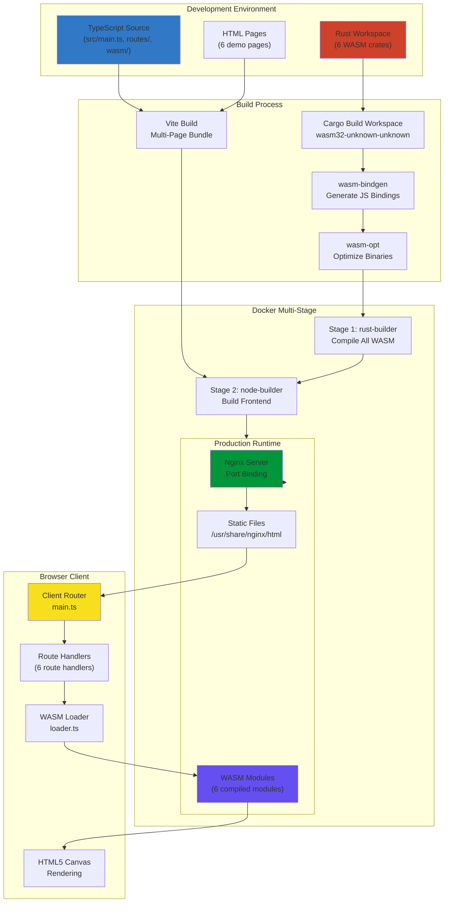
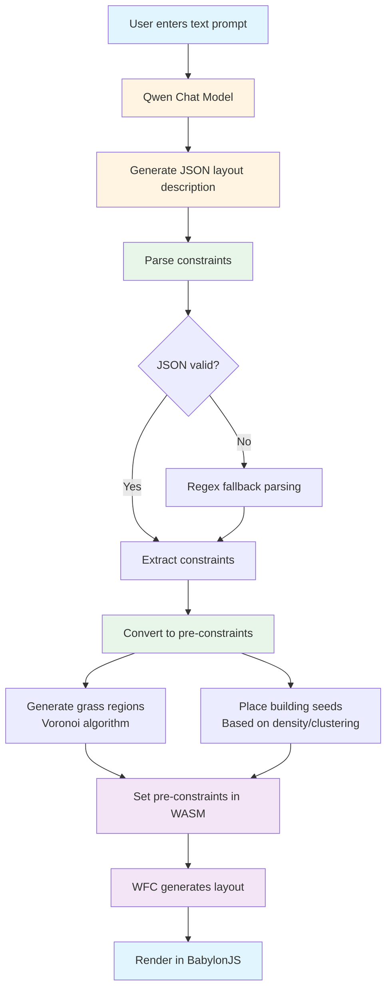

# Fullstack Rust for Sigmas

Welcome to an immersive journey through a production-ready, full-stack web application that combines the power of Rust, WebAssembly, TypeScript, Docker, and cloud deployment. This project demonstrates how modern systems engineering principles come together to create a high-performance, type-safe, and deployable web application.

## What You'll Learn

By studying this project, you'll gain deep understanding of:

- **Rust WebAssembly (WASM)**: How Rust code compiles to WebAssembly and runs in browsers at near-native speed
- **TypeScript Integration**: Type-safe communication between JavaScript and WebAssembly modules
- **Modern Build Systems**: Vite for frontend bundling and optimization
- **Containerization**: Multi-stage Docker builds for efficient, reproducible deployments
- **Web Server Configuration**: Nginx as a reverse proxy with security and performance optimizations
- **Cloud Deployment**: Render.com orchestration with dynamic port binding and health checks
- **System Architecture**: How all these pieces connect to form a cohesive, production-ready application

This isn't just a tutorial—it's a complete, deployable system that you can study, modify, and learn from. Every line of code serves a purpose, and every configuration file teaches you something about modern web development.

---

## High-Level Architecture

Before diving into the code, let's understand how the entire system fits together. This application follows a sophisticated architecture that separates concerns while maintaining tight integration between components.

### System Flow Diagram



### Request Flow

When a user visits your deployed application, here's what happens:

1. **Browser Request**: User navigates to `https://your-app.onrender.com/astar` or `/preprocess`
2. **Render.com Load Balancer**: Routes request to your Docker container
3. **Nginx**: Receives request on dynamically-bound port (set via `$PORT` environment variable)
4. **Static File Serving**: Nginx serves the appropriate HTML page (`pages/astar.html` or `pages/preprocess.html`) from `/usr/share/nginx/html`
5. **JavaScript Execution**: Browser loads and executes bundled TypeScript code (`main.ts`)
6. **Client-Side Routing**: Router in `main.ts` detects the URL path and loads the appropriate route handler
7. **Route Handler Initialization**: Route handler (e.g., `routes/astar.ts` or `routes/preprocess.ts`) initializes
8. **WASM Module Loading**: Route handler uses shared WASM loader to load and validate the appropriate WASM module
9. **WASM Initialization**: JavaScript initializes the WebAssembly module with type-safe validation
10. **Rust Execution**: WASM module runs Rust code (A* pathfinding, image preprocessing, etc.)
11. **Canvas Rendering**: Rust calls back to JavaScript to render on HTML5 Canvas or update DOM
12. **User Interaction**: Keyboard/mouse events flow from JavaScript → WASM → Rust → back to JavaScript for rendering

### Key Architectural Decisions

🧠 **Concept Break**: Why This Architecture?

- **Rust for Performance**: Computational algorithms (A* pathfinding, image processing) benefit from Rust's zero-cost abstractions and memory safety
- **WASM for Browser Execution**: Compiling Rust to WebAssembly allows near-native performance in the browser
- **TypeScript for Type Safety**: TypeScript ensures correct communication between JavaScript and WASM
- **Multi-Endpoint Architecture**: Each endpoint showcases its own WASM module, enabling modularity and easy expansion
- **Client-Side Routing**: Simple router loads endpoint-specific code only when needed, reducing initial bundle size
- **Workspace Structure**: Rust workspace enables multiple WASM crates to share dependencies and build configuration
- **Multi-Stage Docker**: Separates build dependencies from runtime, resulting in a tiny final image (~40MB)
- **Nginx for Production**: Lightweight, battle-tested web server with excellent performance characteristics
- **Render.com for Simplicity**: Platform handles SSL, scaling, and infrastructure management

---

## Multi-Endpoint Architecture

This application uses a multi-endpoint architecture where each endpoint showcases its own specialized WASM module. This design enables modularity, code splitting, and easy addition of new endpoints.

### Architecture Overview

Each endpoint follows a consistent pattern:

1. **Rust Crate**: A workspace member crate (e.g., `wasm-astar`, `wasm-preprocess`) containing the WASM module logic
2. **HTML Page**: A dedicated page in `pages/` directory (e.g., `pages/astar.html`, `pages/preprocess.html`)
3. **Route Handler**: TypeScript module in `src/routes/` that initializes the endpoint's WASM module
4. **Shared Utilities**: Common WASM loading and type definitions in `src/wasm/`

### Client-Side Routing

The application uses a simple client-side router in `src/main.ts`:

```typescript:src/main.ts
import { init as initAstar } from './routes/astar';
import { init as initPreprocessSmolvlm500m } from './routes/preprocess-smolvlm-500m';
import { init as initPreprocessSmolvlm256m } from './routes/preprocess-smolvlm-256m';
import { init as initImageCaptioning } from './routes/image-captioning';
import { init as initFunctionCalling } from './routes/function-calling';
import { init as initFractalChat } from './routes/fractal-chat';
import { init as initHelloWasm } from './routes/hello-wasm';
import { init as initBabylonWfc } from './routes/babylon-wfc';

const routes: Map<string, RouteHandler> = new Map();
routes.set('/astar', initAstar);
routes.set('/preprocess-smolvlm-500m', initPreprocessSmolvlm500m);
routes.set('/preprocess-smolvlm-256m', initPreprocessSmolvlm256m);
routes.set('/image-captioning', initImageCaptioning);
routes.set('/function-calling', initFunctionCalling);
routes.set('/fractal-chat', initFractalChat);
routes.set('/hello-wasm', initHelloWasm);
routes.set('/babylon-wfc', initBabylonWfc);
```

When a user navigates to a URL, the router:
1. Extracts the pathname from `window.location.pathname`
2. Looks up the corresponding route handler
3. Calls the handler's `init()` function
4. The handler loads and initializes the appropriate WASM module

### Benefits of This Architecture

- **Modularity**: Each endpoint is self-contained and independent
- **Code Splitting**: Only the WASM module for the current endpoint is loaded
- **Easy Expansion**: Adding a new endpoint requires minimal changes
- **Type Safety**: Shared utilities ensure consistent, type-safe WASM loading
- **Maintainability**: Clear separation of concerns makes the codebase easier to understand and modify

### Current Endpoints

- **`/astar`**: A* pathfinding algorithm visualization with interactive tile-based world
- **`/preprocess-smolvlm-500m`**: SmolVLM-500M vision-language model for image captioning and VQA
- **`/preprocess-smolvlm-256m`**: SmolVLM-256M vision-language model (smaller, faster variant)
- **`/image-captioning`**: ViT-GPT2 image captioning using Transformers.js
- **`/function-calling`**: Function calling agent with DistilGPT-2 and WASM tools
- **`/fractal-chat`**: Interactive chat that generates fractal images based on keywords, using Qwen1.5-0.5B-Chat and WASM fractal generation
- **`/hello-wasm`**: Student template demonstrating WASM state management pattern for learning
- **`/babylon-wfc`**: Wave Function Collapse algorithm with Voronoi noise for grass generation, visualized in 3D with BabylonJS. Includes text-to-layout generation using Qwen chat model for guided procedural generation

💡 **Tip**: This architecture is inspired by the pattern of using WASM for efficient, low-level computations (like preprocessing for client-side LLMs) while keeping the main application logic in TypeScript.

---

## Backend (Rust)

The Rust backend consists of multiple WASM modules, each compiled as a separate crate in a Cargo workspace. This architecture enables each endpoint to have its own specialized WASM module while sharing common dependencies and build configuration.

### Workspace Structure

The Rust codebase is organized as a Cargo workspace with multiple member crates:

```
Cargo.toml              # Workspace root configuration
wasm-astar/
├── Cargo.toml          # A* pathfinding crate configuration
└── src/
├── lib.rs          # Main entry point, WASM bindings
├── world/
│   ├── mod.rs      # World state and A* algorithm
│   └── tile.rs     # Tile data structure
├── engine/
│   └── mod.rs      # Engine state, input handling, FPS tracking
├── browser/
│   └── mod.rs      # Browser API bindings
└── utils/
    └── mod.rs      # Utility functions (logging, random)
wasm-preprocess/
├── Cargo.toml          # Preprocessing crate configuration
└── src/
    └── lib.rs          # Image and text preprocessing functions
wasm-preprocess-256m/
├── Cargo.toml          # SmolVLM-256M preprocessing crate
└── src/
    └── lib.rs          # Image preprocessing for 256M model
wasm-preprocess-image-captioning/
├── Cargo.toml          # Image captioning preprocessing crate
└── src/
    └── lib.rs          # Image preprocessing and filters
wasm-agent-tools/
├── Cargo.toml          # Agent tools crate configuration
└── src/
    └── lib.rs          # Function calling tools (calculate, process_text, get_stats)
wasm-fractal-chat/
├── Cargo.toml          # Fractal generation crate configuration
└── src/
    └── lib.rs          # Fractal generation algorithms (Mandelbrot, Julia, etc.)
wasm-hello/
├── Cargo.toml          # Hello WASM student template crate configuration
└── src/
    └── lib.rs          # Simple WASM state management demonstration
wasm-babylon-wfc/
├── Cargo.toml          # Wave Function Collapse crate configuration
└── src/
    └── lib.rs          # WFC algorithm with Voronoi noise for grass generation
```

🧠 **Concept Break**: Why a Workspace?

- **Shared Dependencies**: All crates share the same `wasm-bindgen` version and build settings
- **Unified Build**: Build all WASM modules with a single command
- **Dependency Caching**: Cargo caches dependencies across workspace members
- **Version Consistency**: Ensures all crates use compatible dependency versions
- **Easy Expansion**: Adding a new WASM module is as simple as creating a new crate

### Core Concepts

#### 1. WebAssembly Bindings with `wasm-bindgen`

Each workspace crate uses `wasm-bindgen` to create seamless interoperability between Rust and JavaScript. Here's an example from the A* pathfinding module:

```rust:wasm-astar/src/lib.rs
use wasm_bindgen::prelude::*;

#[wasm_bindgen]
pub fn wasm_init(debug: i32, render_interval_ms: i32, window_width: u32, window_height: u32) {
    utils::log("Initializing Rust/WASM");
    // ... initialization code
}
```

And from the preprocessing module:

```rust:wasm-preprocess/src/lib.rs
use wasm_bindgen::prelude::*;

#[wasm_bindgen]
pub fn preprocess_image(
    image_data: &[u8],
    source_width: u32,
    source_height: u32,
    target_width: u32,
    target_height: u32,
) -> Result<Vec<u8>, JsValue> {
    // ... image processing code
}
```

⚙️ **Under the Hood**: The `#[wasm_bindgen]` attribute macro generates JavaScript bindings at compile time. When you call these functions from TypeScript, you're actually calling generated JavaScript functions that marshal arguments, call the WASM function, and marshal return values.

#### 2. Global State with `LazyLock` and `Mutex`

Rust's ownership system prevents global mutable state by default. For WASM applications that need to maintain state across function calls, we use `LazyLock` (Rust 2021) with `Mutex`:

```rust:wasm-astar/src/lib.rs
use std::sync::{LazyLock, Mutex};

static WORLD_STATE: LazyLock<Mutex<WorldState>> = 
    LazyLock::new(|| Mutex::new(WorldState::new()));
static ENGINE_STATE: LazyLock<Mutex<EngineState>> = 
    LazyLock::new(|| Mutex::new(EngineState::new()));
```

🧠 **Concept Break**: Why `LazyLock` and `Mutex`?

- **`LazyLock`**: Initializes the value on first access (lazy initialization). This is perfect for WASM where we don't have a `main()` function that runs at startup.
- **`Mutex`**: Provides thread-safe access to mutable data. Even though WASM runs single-threaded, `Mutex` ensures Rust's borrow checker is satisfied when we need mutable access.

#### 3. The A* Pathfinding Algorithm

The core algorithm lives in `wasm-astar/src/world/mod.rs`. A* is an informed search algorithm that finds the shortest path between two points:

```rust:wasm-astar/src/world/mod.rs
pub fn calc_astar(&mut self) {
    // Open set: nodes to be evaluated
    // Closed set: nodes already evaluated
    // Uses heuristic (estimated distance) + actual cost
    // Always explores the most promising path first
}
```

💡 **Tip**: A* is optimal and complete—it always finds the shortest path if one exists, and it's more efficient than Dijkstra's algorithm because it uses a heuristic to guide the search.

#### 3b. Image Preprocessing

The preprocessing module (`wasm-preprocess`) demonstrates another use case for WASM—efficient image and text processing:

```rust:wasm-preprocess/src/lib.rs
#[wasm_bindgen]
pub fn preprocess_image(
    image_data: &[u8],
    source_width: u32,
    source_height: u32,
    target_width: u32,
    target_height: u32,
) -> Result<Vec<u8>, JsValue> {
    // Resize image using Rust's image crate
    // Returns processed image data
}
```

This module showcases how WASM can handle computationally intensive tasks like image resizing, which is common in ML/AI workflows (e.g., preprocessing images for vision models).

#### 4. Calling JavaScript from Rust

Rust code can call JavaScript functions through `wasm-bindgen`:

```rust:wasm-astar/src/lib.rs
#[wasm_bindgen]
extern "C" {
    #[wasm_bindgen(js_name = "js_draw_tile")]
    fn js_draw_tile(
        layer_id: i32,
        px: f64,
        py: f64,
        size: f64,
        ch: i32, cs: i32, cl: i32, ca: f32,
    );
}
```

This declares that a JavaScript function `js_draw_tile` exists and can be called from Rust. The actual implementation lives in the TypeScript route handler (`src/routes/astar.ts`).

#### 5. Module Organization

Each workspace crate follows Rust's module system. For example, `wasm-astar`:

- **`lib.rs`**: Main entry point, exports public WASM functions
- **`world/mod.rs`**: Game world state, tile management, A* algorithm
- **`engine/mod.rs`**: Input handling, FPS calculation, timing
- **`browser/mod.rs`**: Wrapper functions for browser APIs
- **`utils/mod.rs`**: Shared utilities (logging, random number generation)

The `wasm-preprocess` crate has a simpler structure focused on preprocessing functions.

### Rust Build Configuration

The workspace is defined by the root `Cargo.toml`:

```toml:Cargo.toml
[workspace]
members = [
  "wasm-astar",
  "wasm-preprocess",
  "wasm-preprocess-256m",
  "wasm-preprocess-image-captioning",
  "wasm-agent-tools",
  "wasm-fractal-chat",
  "wasm-hello",
  "wasm-babylon-wfc"
]
resolver = "2"

[workspace.package]
version = "0.1.0"
edition = "2021"

[profile.release]
lto = true          # Link-time optimization
opt-level = 's'     # Optimize for size
```

Each member crate has its own `Cargo.toml`:

```toml:wasm-astar/Cargo.toml
[package]
name = "wasm-astar"
version.workspace = true
edition.workspace = true

[lib]
path = "src/lib.rs"
crate-type = ["cdylib", "rlib"]

[dependencies]
wasm-bindgen = "0.2"
console_error_panic_hook = "0.1"
```

⚙️ **Under the Hood**: 
- **`[workspace]`**: Defines a Cargo workspace with multiple member crates
- **`members`**: Lists all workspace member crates
- **`version.workspace = true`**: Inherits version from workspace root
- **`crate-type = ["cdylib", "rlib"]`**: `cdylib` creates a dynamic library (WASM), `rlib` allows the crate to be used as a dependency
- **`lto = true`**: Link-time optimization reduces binary size and improves performance
- **`opt-level = 's'`**: Optimizes for size rather than speed (important for web delivery)

---

## Frontend (TypeScript)

The TypeScript frontend orchestrates the entire application lifecycle: client-side routing, loading WASM modules, handling user input, and rendering. The architecture is organized into route handlers, shared utilities, and a central router.

### Project Structure

The TypeScript codebase is organized as follows:

```
src/
├── main.ts              # Client-side router
├── routes/
│   ├── astar.ts                    # A* pathfinding route handler
│   ├── preprocess-smolvlm-500m.ts  # SmolVLM-500M route handler
│   ├── preprocess-smolvlm-256m.ts  # SmolVLM-256M route handler
│   ├── image-captioning.ts         # ViT-GPT2 image captioning route handler
│   ├── function-calling.ts         # Function calling agent route handler
│   ├── fractal-chat.ts             # Fractal chat route handler
│   ├── hello-wasm.ts               # Hello WASM student template route handler
│   └── babylon-wfc.ts              # Babylon WFC route handler
├── models/
│   ├── smolvlm.ts                  # SmolVLM-500M model logic
│   ├── smolvlm-256m.ts             # SmolVLM-256M model logic
│   ├── image-captioning.ts         # ViT-GPT2 model logic
│   └── function-calling.ts         # Function calling agent logic
├── wasm/
│   ├── loader.ts        # Generic WASM module loader
│   └── types.ts         # Shared WASM type definitions
├── types.ts             # Application-specific types
└── styles.css           # Shared styles
```

### Client-Side Routing

The application uses a simple client-side router in `src/main.ts`:

```typescript:src/main.ts
import { init as initAstar } from './routes/astar';
import { init as initPreprocess } from './routes/preprocess';

const routes: Map<string, RouteHandler> = new Map();
routes.set('/astar', initAstar);
routes.set('/preprocess', initPreprocess);
routes.set('/', initAstar); // Default route

async function route(): Promise<void> {
  const path = window.location.pathname;
  let handler = routes.get(path);
  
  // Try prefix matching if no exact match
  if (!handler) {
    for (const [routePath, routeHandler] of routes.entries()) {
      if (path.startsWith(routePath) && routePath !== '/') {
        handler = routeHandler;
        break;
      }
    }
  }
  
  if (handler) {
    await handler();
  }
}
```

When the page loads, the router:
1. Reads the current URL pathname
2. Looks up the corresponding route handler
3. Calls the handler's `init()` function
4. The handler loads and initializes the appropriate WASM module

🧠 **Concept Break**: Why Client-Side Routing?

- **Code Splitting**: Each route handler is a separate module, loaded only when needed
- **Modularity**: Each endpoint is self-contained
- **Type Safety**: Route handlers use shared utilities for consistent WASM loading
- **Simple**: No complex routing library needed for this use case
- **Lazy Loading**: WASM modules are only loaded when their route is accessed, reducing initial bundle size
- **Dynamic Imports**: Route handlers use static imports (not dynamic), but WASM modules themselves are loaded dynamically via the WASM loader

**Learning Point**: The router uses a `Map<string, RouteHandler>` where each handler is an async function. When a route is matched, the handler is called, which then:
1. Loads the WASM module (if needed) using the shared `loadWasmModule` utility
2. Validates the module exports match expected TypeScript interfaces
3. Initializes the module with any required parameters
4. Sets up UI event handlers and rendering loops

This pattern ensures type safety while allowing lazy loading of heavy WASM modules.

### Type Safety with Interfaces

Shared type definitions live in `src/wasm/types.ts`:

```typescript:src/wasm/types.ts
export interface WasmModuleBase {
  memory: WebAssembly.Memory;
}

export interface WasmModuleAstar extends WasmModuleBase {
  wasm_init(debug: number, renderIntervalMs: number, windowWidth: number, windowHeight: number): void;
  tick(elapsedTime: number): void;
  key_down(keyCode: number): void;
  key_up(keyCode: number): void;
  mouse_move(x: number, y: number): void;
}

export interface WasmModulePreprocess extends WasmModuleBase {
  preprocess_image(imageData: Uint8Array, sourceWidth: number, sourceHeight: number, targetWidth: number, targetHeight: number): Uint8Array;
  preprocess_text(text: string): Uint32Array;
  normalize_text(text: string): string;
  get_preprocess_stats(originalSize: number, targetSize: number): PreprocessStats;
}
```

Each WASM module has its own interface extending `WasmModuleBase`, ensuring type safety while allowing module-specific functions.

🧠 **Concept Break**: Why TypeScript?

TypeScript catches errors at compile time that would only surface at runtime in JavaScript. When working with WASM, type safety is crucial because:
- WASM functions have specific signatures
- Memory access must be correct
- Type mismatches cause cryptic runtime errors
- Multiple WASM modules require clear type boundaries

### Route Handler Initialization

Each route handler follows a consistent pattern. Here's the A* pathfinding handler:

```typescript:src/routes/astar.ts
import initWasm from '../../pkg/wasm_astar/wasm_astar.js';
import { loadWasmModule, validateWasmModule } from '../wasm/loader';
import type { WasmModuleAstar } from '../wasm/types';

export const init = async (): Promise<void> => {
  // 1. Set up JavaScript functions that Rust will call
  const wasmImports = getWasmImports();
  
  // 2. Make functions globally available for wasm-bindgen
  const globalObj: { [key: string]: unknown } = globalThis;
  globalObj.js_log = (msg: string): void => wasmImports.js_log(msg);
  // ... more functions
  
  // 3. Load and initialize WASM module with type safety
  const wasmModule = await loadWasmModule<WasmModuleAstar>(
    async () => await initWasm(),
    validateAstarModule
  );
  
  // 4. Initialize the WASM module
    wasmModule.wasm_init(debug ? 1 : 0, renderIntervalMs, window.innerWidth, window.innerHeight);
};
```

⚙️ **Under the Hood**: `wasm-bindgen` generates code that expects JavaScript functions to be in the global scope when `__wbg_get_imports()` runs. By assigning to `globalThis`, we ensure these functions are available when WASM initialization occurs. The `loadWasmModule` utility provides type-safe loading with runtime validation.

### Canvas Rendering Layers

The A* pathfinding endpoint uses multiple canvas layers for efficient rendering. This is implemented in the route handler:

```typescript:src/routes/astar.ts
js_create_layer(id: string, key: number): void {
  const canvas = WASM_ASTAR.layerWrapperEl.appendChild(
    document.createElement('canvas')
  );
  const ctx = canvas.getContext('2d');
  
  const layer: Layer = {
    ctx,
    canvas,
    setSize(width: number, height: number, quality: number): void {
      layer.canvas.width = width;
      layer.canvas.height = height;
      layer.canvas.style.width = `${width / quality}px`;
      layer.canvas.style.height = `${height / quality}px`;
    },
    // ... more methods
  };
  
  WASM_ASTAR.layers.set(key, layer);
}
```

💡 **Tip**: Using multiple canvas layers allows:
- **Background layer**: Static tiles (drawn once)
- **Main layer**: Dynamic path visualization (redrawn every frame)
- **FPS layer**: UI overlay (redrawn periodically)

This is more efficient than redrawing everything every frame. Other endpoints (like preprocessing) may use different rendering approaches (e.g., DOM manipulation for image display).

### Event Handling

User input flows from browser events → TypeScript → WASM. Each route handler sets up its own event listeners:

```typescript:src/routes/astar.ts
window.addEventListener('keydown', (e: KeyboardEvent) => {
  if (WASM_ASTAR.wasmModule) {
    WASM_ASTAR.wasmModule.key_down(e.keyCode);
  }
});

window.addEventListener('mousemove', (e: MouseEvent) => {
  const x = e.pageX - WASM_ASTAR.layerWrapperEl.offsetLeft;
  const y = e.pageY - WASM_ASTAR.layerWrapperEl.offsetTop;
  if (WASM_ASTAR.wasmModule) {
    WASM_ASTAR.wasmModule.mouse_move(x, y);
  }
});
```

Different endpoints handle different events. The preprocessing endpoint, for example, handles file input and button clicks for image/text processing.

### Animation Loop with `requestAnimationFrame`

The A* pathfinding endpoint uses `requestAnimationFrame` for smooth animation:

```typescript:src/routes/astar.ts
const requestNextFrame = (callback: FrameRequestCallback): void => {
  window.requestAnimationFrame(callback);
};

const startIntervalTickRecursive = (ms: number): void => {
  const loop = (timestamp: DOMHighResTimeStamp) => {
    if (isIntervalTick) {
      WASM_ASTAR.wasmModule?.tick(timestamp);
      requestNextFrame(loop);
    }
  };
  requestNextFrame(loop);
};
```

🧠 **Concept Break**: Why `requestAnimationFrame`?

- **Browser-optimized**: Syncs with display refresh rate (typically 60fps)
- **Efficient**: Browser pauses when tab is hidden
- **Smooth**: Reduces jank and stuttering
- **Modern**: Recommended approach for web animations

Not all endpoints need animation loops. The preprocessing endpoint, for example, responds to user actions (button clicks) rather than running continuous animations.

---

## Shared WASM Utilities

To ensure consistent, type-safe WASM module loading across all endpoints, the application provides shared utilities in `src/wasm/`.

### Generic WASM Loader

The `loadWasmModule` function in `src/wasm/loader.ts` provides a type-safe way to load and validate WASM modules:

```typescript:src/wasm/loader.ts
export async function loadWasmModule<T extends WasmModuleBase>(
  initFn: () => Promise<unknown>,
  validateExports: (exports: unknown) => T | null
): Promise<T> {
  try {
    const initResult = await initFn();
    const validated = validateExports(initResult);
    
    if (!validated) {
      throw new WasmInitError('WASM module does not have expected exports');
    }
    
    return validated;
  } catch (error) {
    if (error instanceof WasmInitError) {
      throw error;
    }
    throw new WasmLoadError('Failed to load WASM module', error);
  }
}
```

This function:
1. Calls the WASM initialization function
2. Validates the exports using a type-safe validator
3. Returns a typed WASM module or throws a descriptive error

### Type Definitions

Shared type definitions in `src/wasm/types.ts` ensure consistency:

```typescript:src/wasm/types.ts
export interface WasmModuleBase {
  memory: WebAssembly.Memory;
}

export interface WasmModuleAstar extends WasmModuleBase {
  wasm_init(debug: number, renderIntervalMs: number, windowWidth: number, windowHeight: number): void;
  tick(elapsedTime: number): void;
  // ... more methods
}

export interface WasmModulePreprocess extends WasmModuleBase {
  preprocess_image(...): Uint8Array;
  preprocess_text(...): Uint32Array;
  // ... more methods
}

export interface WasmModuleAgentTools extends WasmModuleBase {
  calculate(expression: string): string;
  process_text(text: string, operation: string): string;
  get_stats(data: Uint8Array): string;
}

export interface WasmModuleFractalChat extends WasmModuleBase {
  generate_mandelbrot(width: number, height: number): Uint8Array;
  generate_julia(width: number, height: number): Uint8Array;
  generate_buddhabrot(width: number, height: number): Uint8Array;
  generate_orbit_trap(width: number, height: number): Uint8Array;
  generate_gray_scott(width: number, height: number): Uint8Array;
  generate_lsystem(width: number, height: number): Uint8Array;
  generate_fractal_flame(width: number, height: number): Uint8Array;
  generate_strange_attractor(width: number, height: number): Uint8Array;
}
```

Each WASM module interface extends `WasmModuleBase`, ensuring all modules have the required `memory` property while allowing module-specific functions.

### Usage Example

Here's how a route handler uses these utilities:

```typescript:src/routes/astar.ts
import { loadWasmModule, validateWasmModule } from '../wasm/loader';
import type { WasmModuleAstar } from '../wasm/types';

function validateAstarModule(exports: unknown): WasmModuleAstar | null {
  if (!validateWasmModule(exports)) {
    return null;
  }
  
  // Additional validation for A* specific exports
  if (
    typeof exports.wasm_init === 'function' &&
    typeof exports.tick === 'function' &&
    // ... more checks
  ) {
    return exports as WasmModuleAstar;
  }
  
  return null;
}

export const init = async (): Promise<void> => {
  const wasmModule = await loadWasmModule<WasmModuleAstar>(
    async () => await initWasm(),
    validateAstarModule
  );
  
  // Use wasmModule with full type safety
  wasmModule.wasm_init(debug ? 1 : 0, renderIntervalMs, window.innerWidth, window.innerHeight);
};
```

🧠 **Concept Break**: Why Shared Utilities?

- **Consistency**: All endpoints use the same loading pattern
- **Type Safety**: Compile-time guarantees about WASM module structure
- **Error Handling**: Consistent error messages and error types
- **Maintainability**: Changes to loading logic happen in one place
- **Reusability**: Easy to add new endpoints following the same pattern

---

## WebAssembly Integration

WebAssembly (WASM) is a binary instruction format that runs in browsers at near-native speed. This project compiles Rust to WASM, enabling high-performance computation in the browser.

### Compilation Target

Rust code compiles to the `wasm32-unknown-unknown` target:

```bash
rustup target add wasm32-unknown-unknown
cargo build --target wasm32-unknown-unknown --release
```

This creates a `.wasm` binary that can run in any WebAssembly-compatible environment (browsers, Node.js, etc.).

### Build Process

The build process uses a two-script approach to handle multiple WASM modules:

**Main build script** (`scripts/build.sh`) iterates over all workspace members:

```bash:scripts/build.sh
#!/bin/bash
set -e

echo "BUILDING ALL WASM MODULES"

# Clean previous build
if [ -d "pkg" ]; then
    rm -rf "pkg"
fi

# Build each WASM module
./scripts/build-wasm.sh wasm-astar pkg/wasm_astar
./scripts/build-wasm.sh wasm-preprocess pkg/wasm_preprocess
./scripts/build-wasm.sh wasm-preprocess-256m pkg/wasm_preprocess_256m
./scripts/build-wasm.sh wasm-preprocess-image-captioning pkg/wasm_preprocess_image_captioning
./scripts/build-wasm.sh wasm-agent-tools pkg/wasm_agent_tools
./scripts/build-wasm.sh wasm-fractal-chat pkg/wasm_fractal_chat
./scripts/build-wasm.sh wasm-hello pkg/wasm_hello
./scripts/build-wasm.sh wasm-babylon-wfc pkg/wasm_babylon_wfc
./scripts/build-wasm.sh wasm-preprocess-image-captioning pkg/wasm_preprocess_image_captioning
./scripts/build-wasm.sh wasm-agent-tools pkg/wasm_agent_tools
./scripts/build-wasm.sh wasm-fractal-chat pkg/wasm_fractal_chat

echo "ALL WASM MODULES BUILT SUCCESSFULLY"
```

**Helper script** (`scripts/build-wasm.sh`) builds a single WASM crate:

```bash:scripts/build-wasm.sh
#!/bin/bash
set -e

CRATE_NAME=$1
OUTPUT_DIR=$2

# 1. Compile Rust crate to WASM
cargo build --target wasm32-unknown-unknown --release --package "$CRATE_NAME"

# 2. Convert crate name (hyphens to underscores for filename)
WASM_FILENAME=$(echo "$CRATE_NAME" | sed 's/-/_/g')

# 3. Generate JavaScript bindings with wasm-bindgen
wasm-bindgen --target web \
    --out-dir "$OUTPUT_DIR" \
    "target/wasm32-unknown-unknown/release/${WASM_FILENAME}.wasm"

# 4. Optimize WASM binary with wasm-opt
if command -v wasm-opt &> /dev/null; then
    wasm-opt -Os "$OUTPUT_DIR/${WASM_FILENAME}_bg.wasm" -o "$OUTPUT_DIR/${WASM_FILENAME}_bg.wasm"
fi
```

⚙️ **Under the Hood**: 
- **Workspace build**: `cargo build --package` builds a specific workspace member
- **Filename conversion**: Cargo converts hyphens to underscores in output filenames (e.g., `wasm-astar` → `wasm_astar.wasm`)
- **`wasm-bindgen --target web`**: Generates JavaScript/TypeScript bindings for browser use
- **`wasm-opt -Os`**: Optimizes for size (reduces binary size by ~30-50%)

### Generated Files

After building, each WASM module generates its own set of files in `pkg/`:

```
pkg/
├── wasm_astar/
│   ├── wasm_astar_bg.wasm      # Optimized WebAssembly binary
│   ├── wasm_astar.js            # JavaScript glue code
│   ├── wasm_astar.d.ts          # TypeScript type definitions
│   └── wasm_astar_bg.wasm.d.ts  # WASM binary type definitions
├── wasm_preprocess/
│   ├── wasm_preprocess_bg.wasm
│   ├── wasm_preprocess.js
│   ├── wasm_preprocess.d.ts
│   └── wasm_preprocess_bg.wasm.d.ts
├── wasm_preprocess_256m/
│   ├── wasm_preprocess_256m_bg.wasm
│   ├── wasm_preprocess_256m.js
│   ├── wasm_preprocess_256m.d.ts
│   └── wasm_preprocess_256m_bg.wasm.d.ts
├── wasm_preprocess_image_captioning/
│   ├── wasm_preprocess_image_captioning_bg.wasm
│   ├── wasm_preprocess_image_captioning.js
│   ├── wasm_preprocess_image_captioning.d.ts
│   └── wasm_preprocess_image_captioning_bg.wasm.d.ts
└── wasm_agent_tools/
    ├── wasm_agent_tools_bg.wasm
    ├── wasm_agent_tools.js
    ├── wasm_agent_tools.d.ts
    └── wasm_agent_tools_bg.wasm.d.ts
└── wasm_fractal_chat/
    ├── wasm_fractal_chat_bg.wasm
    ├── wasm_fractal_chat.js
    ├── wasm_fractal_chat.d.ts
    └── wasm_fractal_chat_bg.wasm.d.ts
├── wasm_hello/
│   ├── wasm_hello_bg.wasm
│   ├── wasm_hello.js
│   ├── wasm_hello.d.ts
│   └── wasm_hello_bg.wasm.d.ts
└── wasm_babylon_wfc/
    ├── wasm_babylon_wfc_bg.wasm
    ├── wasm_babylon_wfc.js
    ├── wasm_babylon_wfc.d.ts
    └── wasm_babylon_wfc_bg.wasm.d.ts
```

Each module is self-contained with its own JavaScript bindings and type definitions.

### Loading WASM in the Browser

Each route handler loads its own WASM module. Vite handles WASM loading automatically:

```typescript:src/routes/astar.ts
import initWasm from '../../pkg/wasm_astar/wasm_astar.js';
```

```typescript:src/routes/preprocess-smolvlm-500m.ts
import initWasm from '../../pkg/wasm_preprocess/wasm_preprocess.js';
```

```typescript:src/routes/function-calling.ts
import initWasm from '../../pkg/wasm_agent_tools/wasm_agent_tools.js';
```

```typescript:src/routes/fractal-chat.ts
import initWasm from '../../pkg/wasm_fractal_chat/wasm_fractal_chat.js';
```

Vite's WASM plugin:
1. Detects `.wasm` imports
2. Loads the binary asynchronously
3. Instantiates the WebAssembly module
4. Provides the initialized module to your code

Each route handler uses the shared `loadWasmModule` utility to ensure type-safe loading and validation.

### Memory Management

Each WASM module has its own linear memory space:

```typescript:src/wasm/types.ts
export interface WasmModuleBase {
  memory: WebAssembly.Memory;
}
```

All WASM module interfaces extend `WasmModuleBase`, ensuring every module exposes its memory for potential JavaScript access.

🧠 **Concept Break**: WASM Memory

- **Linear Memory**: A contiguous byte array that WASM can read/write
- **Shared with JavaScript**: JavaScript can read WASM memory (useful for passing large data)
- **Bounds Checked**: WASM enforces memory safety (no buffer overflows)
- **Growable**: Memory can expand as needed (up to limits)
- **Per-Module**: Each WASM module has its own isolated memory space

### Performance Benefits

Why use WASM for these computations?

- **Near-Native Speed**: Algorithms run at ~95% of native Rust performance
- **Deterministic**: Same algorithm, same results, regardless of browser
- **Memory Efficient**: Rust's zero-cost abstractions mean minimal overhead
- **Type Safe**: Compile-time guarantees prevent runtime errors
- **Modular**: Each endpoint loads only the WASM module it needs

💡 **Tip**: WASM is ideal for:
- Computational-heavy algorithms (pathfinding, image processing, cryptography)
- Game engines and physics simulations
- Data processing and transformation
- Preprocessing for ML/AI workflows (image resizing, tokenization)
- Any code that benefits from Rust's performance and safety

The multi-module architecture allows each endpoint to showcase a different use case for WASM, demonstrating its versatility.

---

## Transformers.js Integration

Some endpoints use Transformers.js for client-side LLM inference, which provides a simpler API than manual ONNX model management.

### What is Transformers.js?

Transformers.js is a JavaScript library that runs Hugging Face models directly in the browser. It automatically:
- Downloads and caches ONNX models from Hugging Face
- Handles tokenization
- Manages model inference
- Provides type-safe TypeScript interfaces

### Endpoints Using Transformers.js

1. **`/image-captioning`**: Uses `Xenova/vit-gpt2-image-captioning` for image captioning
2. **`/function-calling`**: Uses `Xenova/distilgpt2` for text generation in the Function Calling Agent
3. **`/fractal-chat`**: Uses `Xenova/qwen1.5-0.5b-chat` for conversational AI responses when no fractal keyword is detected
4. **`/babylon-wfc`**: Uses `Xenova/qwen1.5-0.5b-chat` for text-to-layout generation (converting natural language prompts to WFC constraints)

**Learning Point**: Chat models (like Qwen) are better at instruction following and structured output than base models (like DistilGPT-2). This makes them ideal for tasks like:
- Generating structured JSON from natural language
- Following complex instructions
- Understanding context and nuance

The `/babylon-wfc` endpoint demonstrates this by using Qwen to convert text prompts like "sparse buildings" into structured constraint data that guides the WFC algorithm.

### How It Works

```typescript
import { pipeline, type Pipeline } from '@xenova/transformers';

// Initialize pipeline (automatically downloads and loads model)
const imageToTextPipeline = await pipeline(
  'image-to-text',
  'Xenova/vit-gpt2-image-captioning'
);

// Use pipeline
const result = await imageToTextPipeline(imageDataUrl);
```

### CORS Proxy Integration

Transformers.js uses a custom fetch function to handle CORS restrictions when loading models from Hugging Face:

```typescript
import { env } from '@xenova/transformers';

env.fetch = (input: RequestInfo | URL, init?: RequestInit) => {
  return customFetch(input, init, onLog); // Custom fetch with CORS proxy support
};
```

### Benefits

- **Simplified API**: No manual tensor management
- **Automatic Caching**: Models cached in IndexedDB
- **Type Safety**: TypeScript interfaces for pipeline results
- **Model Variety**: Access to many pre-converted Hugging Face models

### Trade-offs

- **Less Control**: Can't customize inference as much as manual ONNX
- **Model Selection**: Limited to models converted for Transformers.js
- **File Size**: Includes tokenizers and model loaders

For endpoints that need maximum control (like SmolVLM), we use manual ONNX management. For simpler use cases, Transformers.js provides a better developer experience.

---

## DevOps & Deployment

This section covers how the application is containerized, configured, and deployed to production.

### Multi-Stage Docker Build

The Dockerfile uses a multi-stage build to create a minimal production image:

```dockerfile:Dockerfile
# Stage 1: Rust WASM Builder
FROM rust:alpine AS rust-builder
# ... install dependencies, build all WASM modules

# Stage 2: Node.js Frontend Builder
FROM node:22-alpine AS node-builder
# ... install npm deps, build with Vite (multi-page)

# Stage 3: Runtime (nginx)
FROM nginx:alpine AS runtime
# ... copy built files, configure nginx
```

🧠 **Concept Break**: Why Multi-Stage Builds?

- **Stage 1** (~500MB): Contains Rust compiler, Cargo, build tools
- **Stage 2** (~200MB): Contains Node.js, npm, Vite
- **Stage 3** (~40MB): Contains only nginx and built static files

By using multi-stage builds, the final image is **92% smaller** than if we included all build tools. This means:
- Faster deployments
- Lower bandwidth usage
- Reduced attack surface
- Smaller storage costs

### Stage 1: Rust WASM Compilation

```dockerfile:Dockerfile
FROM rust:alpine AS rust-builder

# Install build dependencies
RUN apk add --no-cache musl-dev perl make git bash jq

# Install wasm-bindgen-cli (must match Cargo.toml version)
RUN cargo install wasm-bindgen-cli --version 0.2.106

# Install wasm-opt for optimization
RUN apk add --no-cache binaryen

WORKDIR /app

# Copy workspace Cargo.toml and member Cargo.toml files for dependency caching
COPY Cargo.toml ./
COPY wasm-astar/Cargo.toml ./wasm-astar/
COPY wasm-preprocess/Cargo.toml ./wasm-preprocess/
COPY wasm-preprocess-256m/Cargo.toml ./wasm-preprocess-256m/
COPY wasm-preprocess-image-captioning/Cargo.toml ./wasm-preprocess-image-captioning/
COPY wasm-agent-tools/Cargo.toml ./wasm-agent-tools/
COPY wasm-fractal-chat/Cargo.toml ./wasm-fractal-chat/
COPY wasm-hello/Cargo.toml ./wasm-hello/
COPY wasm-babylon-wfc/Cargo.toml ./wasm-babylon-wfc/

# Create dummy src files to cache dependencies
RUN mkdir -p wasm-astar/src wasm-preprocess/src wasm-preprocess-256m/src wasm-preprocess-image-captioning/src wasm-agent-tools/src wasm-fractal-chat/src wasm-hello/src wasm-babylon-wfc/src && \
    echo "fn main() {}" > wasm-astar/src/lib.rs || true && \
    echo "fn main() {}" > wasm-preprocess/src/lib.rs || true && \
    echo "fn main() {}" > wasm-preprocess-256m/src/lib.rs || true && \
    echo "fn main() {}" > wasm-preprocess-image-captioning/src/lib.rs || true && \
    echo "fn main() {}" > wasm-agent-tools/src/lib.rs || true && \
    echo "fn main() {}" > wasm-fractal-chat/src/lib.rs || true && \
    echo "fn main() {}" > wasm-hello/src/lib.rs || true && \
    echo "fn main() {}" > wasm-babylon-wfc/src/lib.rs || true

# Build dependencies (cached if Cargo.toml unchanged)
RUN cargo build --target wasm32-unknown-unknown --release --workspace || true

# Copy actual source code
COPY wasm-astar ./wasm-astar
COPY wasm-preprocess ./wasm-preprocess
COPY wasm-preprocess-256m ./wasm-preprocess-256m
COPY wasm-preprocess-image-captioning ./wasm-preprocess-image-captioning
COPY wasm-agent-tools ./wasm-agent-tools
COPY wasm-fractal-chat ./wasm-fractal-chat
COPY wasm-hello ./wasm-hello
COPY wasm-babylon-wfc ./wasm-babylon-wfc
COPY scripts ./scripts

# Make build scripts executable
RUN chmod +x scripts/build.sh scripts/build-wasm.sh

# Build all WASM modules
RUN ./scripts/build.sh
```

⚙️ **Under the Hood**: 
- Docker layer caching means if `Cargo.toml` files don't change, dependency compilation is skipped, saving minutes of build time
- The workspace build compiles all member crates in parallel
- The `build.sh` script iterates over all workspace members and builds each WASM module

### Stage 2: Frontend Build

```dockerfile:Dockerfile
FROM node:22-alpine AS node-builder

WORKDIR /app

# Copy package.json and install dependencies
COPY package.json ./
RUN npm install

# Copy WASM build output from stage 1 (all modules)
COPY --from=rust-builder /app/pkg ./pkg

# Copy frontend source
COPY src ./src
COPY pages ./pages
COPY index.html vite.config.ts tsconfig.json ./
COPY public ./public

# Build with Vite (multi-page build)
RUN npx vite build
```

The `--from=rust-builder` syntax copies files from a previous stage, allowing us to pass all WASM modules to the frontend build stage. Vite's multi-page configuration builds separate bundles for each HTML page in `pages/`.

### Stage 3: Production Runtime

```dockerfile:Dockerfile
FROM nginx:alpine AS runtime

# Install gettext for envsubst (dynamic port substitution)
RUN apk add --no-cache gettext wget

# Copy built static files from stage 2
COPY --from=node-builder /app/dist /usr/share/nginx/html

# Copy nginx configurations
COPY nginx-main.conf /etc/nginx/nginx.conf
COPY nginx.conf.template /etc/nginx/templates/default.conf.template

# Copy custom entrypoint
COPY docker-entrypoint.sh /docker-entrypoint-custom.sh
RUN chmod +x /docker-entrypoint-custom.sh

EXPOSE 80

HEALTHCHECK --interval=30s --timeout=3s --start-period=5s --retries=3 \
  CMD sh -c 'PORT=${PORT:-80}; wget --no-verbose --tries=1 --spider http://localhost:$PORT/health 2>/dev/null || exit 1'

ENTRYPOINT ["/docker-entrypoint-custom.sh"]
CMD ["nginx", "-g", "daemon off;"]
```

### Nginx Configuration

Nginx serves static files with performance and security optimizations:

#### Main Configuration (`nginx-main.conf`)

```nginx:nginx-main.conf
user nginx;
worker_processes auto;
error_log /var/log/nginx/error.log warn;

events {
    worker_connections 1024;
    use epoll;
    multi_accept on;
}

http {
    # Rate limiting zones
    limit_req_zone $binary_remote_addr zone=general:10m rate=10r/s;
    
    # Performance optimizations
    sendfile on;
    tcp_nopush on;
    tcp_nodelay on;
    keepalive_timeout 65;
    keepalive_requests 100;
    
    # Gzip compression
    gzip on;
    gzip_vary on;
    gzip_comp_level 6;
    gzip_types text/plain text/css application/javascript application/json application/wasm;
    
    include /etc/nginx/conf.d/*.conf;
}
```

#### Server Configuration Template (`nginx.conf.template`)

```nginx:nginx.conf.template
server {
    listen $PORT;  # Dynamic port binding for Render.com
    server_name _;
    root /usr/share/nginx/html;
    index index.html;
    
    # Rate limiting
    limit_req zone=general burst=20 nodelay;
    
    # WASM MIME type (critical!)
    location ~ \.wasm$ {
        add_header Content-Type application/wasm;
        add_header Cache-Control "public, max-age=31536000, immutable";
    }
    
    # Serve static files and handle routing for specific HTML pages
    location / {
        # Try to serve specific HTML files based on the URI
        # For example, /astar serves astar.html, /preprocess serves preprocess.html
        try_files $uri $uri/ /pages/$uri.html /index.html;
    }
    
    # Security headers
    add_header X-Frame-Options "SAMEORIGIN" always;
    add_header X-Content-Type-Options "nosniff" always;
    add_header Content-Security-Policy "default-src 'self'; script-src 'self' 'unsafe-inline' 'unsafe-eval'; ..." always;
    add_header Strict-Transport-Security "max-age=31536000; includeSubDomains; preload" always;
    
    # Health check endpoint
    location /health {
        limit_req off;
        return 200 "healthy\n";
    }
}
```

The `try_files` directive ensures that requests to `/astar` serve `pages/astar.html` and requests to `/preprocess` serve `pages/preprocess.html`, with `index.html` as a fallback.

⚙️ **Under the Hood**: The `$PORT` variable is substituted at container startup using `envsubst`. This allows the same Docker image to run on different ports (Render.com assigns ports dynamically).

### Dynamic Port Binding

Render.com assigns ports dynamically. Our entrypoint script handles this:

```bash:docker-entrypoint.sh
#!/bin/sh
set -e

# Set default PORT to 80 if not provided (for local testing)
export PORT=${PORT:-80}

# nginx:alpine's entrypoint processes templates automatically
exec /docker-entrypoint.sh "$@"
```

🧠 **Concept Break**: Why Dynamic Ports?

Cloud platforms like Render.com assign ports at runtime to:
- Allow multiple services on the same host
- Support rolling deployments
- Enable port-based routing in load balancers

Your application must read `$PORT` and bind to it, not hardcode port 80.

### Render.com Configuration

The `render.yaml` file defines the deployment:

```yaml:render.yaml
services:
  - type: web
    name: sigma-wasm
    env: docker
    plan: free
    region: oregon
    dockerfilePath: ./Dockerfile
    dockerContext: .
    healthCheckPath: /
    autoDeploy: true
    envVars:
      - key: NODE_ENV
        value: production
    buildFilter:
      paths:
        - src/**
        - wasm-astar/**
        - wasm-preprocess/**
        - wasm-preprocess-256m/**
        - wasm-preprocess-image-captioning/**
        - wasm-agent-tools/**
        - wasm-fractal-chat/**
        - wasm-hello/**
        - wasm-babylon-wfc/**
        - Cargo.toml
        - package.json
        - vite.config.ts
        - tsconfig.json
        - Dockerfile
        - nginx*.conf*
        - docker-entrypoint.sh
        - scripts/**
        - pages/**
        - index.html
```

💡 **Tip**: `buildFilter` tells Render.com which files trigger a rebuild. This prevents unnecessary builds when only documentation changes. The filter includes all workspace member directories (`wasm-astar/**`, `wasm-preprocess/**`) and the `pages/` directory to ensure changes to any endpoint trigger a rebuild.

### Deployment Process

1. **Push to Git**: Render.com watches your repository
2. **Auto-Deploy**: When `buildFilter` paths change, Render.com:
   - Clones the repository
   - Builds the Docker image (all 3 stages)
   - Runs health checks
   - Routes traffic to the new container
3. **Zero-Downtime**: Old container stays running until new one is healthy

---

## Networking Concepts

Understanding how data flows through the network stack is crucial for debugging and optimization.

### HTTP Request Flow

```
User's Browser
    ↓ (HTTPS request)
Render.com Load Balancer
    ↓ (HTTP request, port assigned)
Docker Container (nginx)
    ↓ (file system read)
/usr/share/nginx/html/index.html
    ↓ (HTTP response)
User's Browser
```

### Reverse Proxy

Nginx acts as a reverse proxy, meaning it:
- **Receives** requests from clients
- **Serves** static files directly (no backend application server needed)
- **Handles** SSL termination (Render.com provides SSL)
- **Applies** security headers and rate limiting

🧠 **Concept Break**: Reverse Proxy vs. Forward Proxy

- **Reverse Proxy**: Sits in front of servers, handles requests on their behalf
- **Forward Proxy**: Sits in front of clients, handles requests on their behalf

In this architecture, Nginx is a reverse proxy because it receives requests intended for your application.

### Static File Serving

Nginx excels at serving static files because:
- **Efficient I/O**: Uses `sendfile()` system call (zero-copy)
- **Connection Pooling**: Keeps connections alive (`keepalive_timeout`)
- **Caching**: Headers tell browsers to cache assets
- **Compression**: Gzip reduces bandwidth by ~70%

### Health Checks

Both Docker and Render.com perform health checks:

**Docker HEALTHCHECK**:
```dockerfile
HEALTHCHECK --interval=30s --timeout=3s --start-period=5s --retries=3 \
  CMD sh -c 'PORT=${PORT:-80}; wget --spider http://localhost:$PORT/health'
```

**Render.com Health Check**:
```yaml
healthCheckPath: /
```

If health checks fail:
- Docker marks container as unhealthy
- Render.com doesn't route traffic to unhealthy containers
- Old containers stay running until new ones are healthy (zero-downtime)

### Security Headers Explained

```nginx
# Prevent clickjacking
add_header X-Frame-Options "SAMEORIGIN" always;

# Prevent MIME type sniffing
add_header X-Content-Type-Options "nosniff" always;

# Enable browser XSS protection
add_header X-XSS-Protection "1; mode=block" always;

# Control referrer information
add_header Referrer-Policy "strict-origin-when-cross-origin" always;

# Content Security Policy (prevents XSS, data injection)
add_header Content-Security-Policy "default-src 'self'; ..." always;

# Force HTTPS (HSTS)
add_header Strict-Transport-Security "max-age=31536000; includeSubDomains; preload" always;
```

💡 **Tip**: Security headers are defense-in-depth. They don't replace secure coding practices, but they mitigate common attack vectors.

---

## Key Takeaways and Next Steps

Congratulations! You've now seen how a complete, production-ready web application is built from code to cloud. Let's synthesize what you've learned.

### The Complete Stack

1. **Rust** → Compiles to WebAssembly for browser execution
2. **WebAssembly** → Near-native performance in the browser
3. **TypeScript** → Type-safe JavaScript with WASM integration
4. **Vite** → Modern build tool for fast development and optimized production builds
5. **Docker** → Containerization for consistent, reproducible deployments
6. **Nginx** → Production-grade web server with security and performance optimizations
7. **Render.com** → Cloud platform handling infrastructure, SSL, and scaling

### Core Concepts You Now Understand

- **Compilation Targets**: How Rust targets different platforms (`wasm32-unknown-unknown`)
- **Type Safety**: How TypeScript interfaces ensure correct WASM integration
- **Multi-Stage Builds**: How Docker creates minimal production images
- **Reverse Proxies**: How Nginx serves static files efficiently
- **Dynamic Configuration**: How environment variables enable flexible deployments
- **Health Checks**: How systems ensure service availability

### Suggested Exercises

Now that you understand the architecture, try these exercises:

1. **Modify the A* Algorithm**: Change the heuristic function in `wasm-astar/src/world/mod.rs` to see how it affects pathfinding behavior

2. **Add a New Canvas Layer**: Create a UI layer that shows algorithm statistics (nodes explored, path length, etc.)

3. **Add a New Endpoint**: Create a new endpoint with its own WASM module (see "Adding New Endpoints" section below)

4. **Create a Shared Utility WASM Module**: Build a WASM module that provides utilities used by multiple endpoints

5. **Optimize the Docker Build**: Experiment with different base images or build optimizations to reduce image size further

6. **Add Environment Variables**: Create a configuration system that allows different settings via environment variables

7. **Profile Performance**: Use browser DevTools to profile WASM execution and identify bottlenecks

8. **Deploy to Another Platform**: Adapt the Dockerfile and configuration for AWS, Google Cloud, or Azure

### Further Reading

- **Rust Book**: https://doc.rust-lang.org/book/
- **WebAssembly Specification**: https://webassembly.org/
- **wasm-bindgen Guide**: https://rustwasm.github.io/docs/wasm-bindgen/
- **Nginx Documentation**: https://nginx.org/en/docs/
- **Docker Best Practices**: https://docs.docker.com/develop/dev-best-practices/

### Now You Know the Stack

You've journeyed from Rust source code to a deployed web application. You understand:

- How **Rust's type system** ensures memory safety while compiling to efficient WASM
- How **Rust workspaces** enable multiple WASM modules in a single project
- How **TypeScript** provides type safety for JavaScript-WASM interop
- How **Client-side routing** enables modular, endpoint-based architecture
- How **Vite** bundles and optimizes modern web applications with multi-page support
- How **Docker multi-stage builds** create minimal production images
- How **Nginx** serves static files with security and performance optimizations
- How **Render.com** orchestrates deployments with zero-downtime

This is a complete, production-ready stack. Every component serves a purpose, every configuration has a reason, and every line of code teaches you something about modern systems engineering.

**You're now equipped to build and deploy your own full-stack Rust applications with multiple WASM modules.**

---

## WFC Algorithm Deep Dive

The `/babylon-wfc` endpoint demonstrates a sophisticated implementation of the Wave Function Collapse algorithm with text-to-layout generation. This section provides a deep technical dive into how it works.

### Wave Function Collapse Fundamentals

**Core Concept**: WFC is a constraint-based procedural generation algorithm inspired by quantum mechanics. Each cell in the grid starts in a "superposition" of all possible tile types, then "collapses" to a single state based on constraints from neighboring cells.

**Key Data Structures**:

```rust:wasm-babylon-wfc/src/lib.rs
// Each cell maintains a list of possible tile types
struct WaveCell {
    possible_tiles: Vec<TileType>,
}

// The grid state tracks both collapsed tiles and wave functions
struct WfcState {
    grid: [[Option<TileType>; 50]; 50],           // Collapsed tiles
    wave: [[WaveCell; 50]; 50],                    // Wave functions (superposition)
    pre_constraints: [[Option<TileType>; 50]; 50], // Pre-set constraints
}
```

**Entropy Calculation**:

Entropy is simply the number of possible tile types remaining for a cell:

```rust
fn entropy(&self) -> usize {
    self.possible_tiles.len()
}
```

**Why Lowest Entropy First?**: Collapsing cells with fewer possibilities first minimizes contradictions. If a cell only has 2 possible tiles, it's more "certain" than a cell with 10 possibilities. This greedy approach leads to more successful completions.

**Constraint Propagation**:

When a cell is collapsed, its edges define what neighbors can be:

```rust
fn propagate_constraints(&mut self, x: i32, y: i32) {
    let tile = self.grid[y][x]; // The collapsed tile
    let edges = get_tile_edges(tile);
    
    // For each neighbor (north, south, east, west):
    // 1. Get the neighbor's current wave function
    // 2. Remove all tile types whose edges don't match
    // 3. If any tiles were removed, recursively propagate to that neighbor
}
```

**Edge Compatibility Rules**:

Each tile type has 4 edges (North, South, East, West), and each edge has a type:
- `Empty`: Exterior space (connects to grass or other empty edges)
- `Wall`: Connects walls in the same direction (allows wide buildings)
- `Floor`: Interior space (connects floors, doors, wall interiors)
- `Grass`: Natural terrain
- `Door`: Passage (connects to floor)

**Key Rule**: Walls can be adjacent in the same direction (e.g., multiple `WallNorth` tiles in a row) but NOT in opposite directions (prevents double-thick walls). This allows wide/deep buildings while maintaining single-thick walls.

**Pre-Constraints System**:

Pre-constraints allow external systems to set specific tiles before WFC runs:

```rust
#[wasm_bindgen]
pub fn set_pre_constraint(x: i32, y: i32, tile_type: i32) -> bool {
    // Sets a tile type at (x, y) before WFC begins
    // This tile will be collapsed immediately when WFC starts
}
```

**Use Cases**:
1. **Voronoi Grass**: Grass regions are pre-set using Voronoi noise
2. **Text-to-Layout**: User-specified constraints from natural language
3. **Building Seeds**: Floor tiles placed at building seed positions

**Gap Prevention**:

After the main WFC loop, any remaining uncollapsed cells are filled:

```rust
// After WFC loop completes
for y in 0..height {
    for x in 0..width {
        if grid[y][x].is_none() {
            // Fill with floor as fallback
            grid[y][x] = Some(TileType::Floor);
        }
    }
}
```

This ensures no gaps remain, especially at grass borders where edge compatibility might leave cells uncollapsed.

### Text-to-Layout Workflow (TileGPT-Inspired)

The text-to-layout feature combines natural language understanding with constraint-based generation, inspired by the [TileGPT paper](https://tilegpt.github.io/).

**Workflow Diagram**:



**Step 1: Qwen Chat Model Integration**

The Qwen chat model (`Xenova/qwen1.5-0.5b-chat`) is used instead of a base model because:

- **Chat Template Format**: Uses proper message formatting for structured output
- **Better Instruction Following**: Chat models are fine-tuned to follow instructions
- **Structured Output**: More likely to generate valid JSON when requested

```typescript:src/routes/babylon-wfc.ts
const messages = [
  {
    role: 'user',
    content: `Generate a layout description for a 50x50 grid based on: "${prompt}"
    
    Provide a JSON object with:
    - buildingDensity: "sparse" | "medium" | "dense"
    - clustering: "clustered" | "distributed" | "random"
    - grassRatio: number between 0.0 and 1.0
    - buildingSizeHint: "small" | "medium" | "large"
    
    Respond with only the JSON object, no additional text.`
  }
];

const formattedPrompt = tokenizer.apply_chat_template(messages, {
  tokenize: false,
  add_generation_prompt: true,
});
```

**Step 2: Constraint Parsing**

The system uses a two-stage parsing approach:

1. **JSON Parsing** (preferred): Attempts to parse JSON from the model output
2. **Regex Fallback**: If JSON parsing fails, uses regex patterns to extract values
3. **Default Values**: If both fail, uses reasonable defaults

```typescript:src/routes/babylon-wfc.ts
function parseLayoutConstraints(output: string): LayoutConstraints {
  // Try JSON parsing first
  try {
    const jsonMatch = output.match(/\{[\s\S]*\}/);
    if (jsonMatch) {
      const parsed = JSON.parse(jsonMatch[0]);
      // Validate and extract fields...
      return constraints;
    }
  } catch {
    // Fall back to regex parsing
  }
  
  // Regex fallback with defaults
  // ...
}
```

**Step 3: Pre-Constraint Conversion**

Constraints are converted to specific tile placements:

```typescript:src/routes/babylon-wfc.ts
function constraintsToPreConstraints(
  constraints: LayoutConstraints,
  width: number,
  height: number
): Array<{ x: number; y: number; tileType: TileType }> {
  // 1. Generate grass regions using Voronoi-like algorithm
  //    - Number of seeds based on grassRatio
  //    - Each cell assigned to closest seed
  //    - Cells within max distance become grass
  
  // 2. Place building seeds based on density and clustering
  //    - Clustered: Group buildings into clusters
  //    - Distributed: Spread evenly
  //    - Random: Random placement
  
  // 3. Convert seeds to Floor tile pre-constraints
  //    - Building seeds become Floor tiles
  //    - Grass regions become Grass tiles
  
  return preConstraints;
}
```

**Step 4: WFC Generation with Pre-Constraints**

The WFC algorithm runs with pre-constraints applied:

```rust:wasm-babylon-wfc/src/lib.rs
// Phase 2: Apply pre-constraints
for y in 0..height {
    for x in 0..width {
        if let Some(pre_tile) = pre_constraints[y][x] {
            // Pre-collapse with constraint
            grid[y][x] = Some(pre_tile);
            wave[y][x].possible_tiles = vec![pre_tile];
        }
    }
}

// Propagate constraints from pre-collapsed cells
// Then run normal WFC algorithm...
```

**Learning Points**:

- **Why Qwen?**: Chat models are better at instruction following and structured output than base models
- **Why Two-Stage Parsing?**: JSON is preferred but regex provides robustness
- **Why Pre-Constraints?**: Allows high-level control while letting WFC handle details
- **Why Voronoi for Grass?**: Creates natural-looking, irregular regions instead of uniform blocks

---

## Learning Path

This section provides a suggested learning path for studying this codebase, organized by skill level and topic.

### Prerequisites

Before diving into the codebase, you should be familiar with:

- **Rust Basics**: Ownership, borrowing, basic syntax
- **TypeScript Basics**: Types, interfaces, async/await
- **Web Fundamentals**: HTML, CSS, JavaScript, DOM APIs
- **Command Line**: Basic terminal usage, package managers

### Beginner Path

**Goal**: Understand the basic WASM integration pattern

1. **Start with `/hello-wasm`**:
   - Simplest endpoint, demonstrates core patterns
   - Study `wasm-hello/src/lib.rs` for Rust state management
   - Study `src/routes/hello-wasm.ts` for TypeScript integration
   - **Key Concepts**: `LazyLock<Mutex<State>>`, `#[wasm_bindgen]`, type safety

2. **Study the WASM Loader**:
   - Read `src/wasm/loader.ts` to understand module loading
   - Read `src/wasm/types.ts` to understand type definitions
   - **Key Concepts**: Dynamic imports, runtime validation, error handling

3. **Understand the Router**:
   - Read `src/main.ts` to see how routes are registered
   - **Key Concepts**: Client-side routing, lazy loading, error handling

### Intermediate Path

**Goal**: Understand algorithm implementation and 3D rendering

1. **Study `/astar`**:
   - More complex state management
   - Game loop pattern with `requestAnimationFrame`
   - Canvas rendering
   - **Key Concepts**: Game state, input handling, rendering loops

2. **Study `/babylon-wfc`**:
   - WFC algorithm implementation
   - 3D rendering with BabylonJS
   - Mesh instancing for performance
   - **Key Concepts**: Constraint propagation, entropy, 3D graphics

3. **Study Image Preprocessing**:
   - Read `wasm-preprocess/src/lib.rs`
   - Understand image manipulation in Rust
   - **Key Concepts**: Image processing, memory management, WASM performance

### Advanced Path

**Goal**: Understand AI/ML integration and complex workflows

1. **Study `/function-calling`**:
   - Transformers.js integration
   - Function calling pattern
   - Agent architecture
   - **Key Concepts**: LLM integration, tool calling, agent patterns

2. **Study `/fractal-chat`**:
   - Hybrid WASM + Transformers.js
   - Chat template usage
   - Keyword detection
   - **Key Concepts**: Multi-technology integration, chat models

3. **Study `/babylon-wfc` Text-to-Layout**:
   - Qwen chat model integration
   - Constraint parsing and conversion
   - Pre-constraint system
   - **Key Concepts**: Natural language to structured data, constraint-based generation

4. **Study SmolVLM Integration**:
   - ONNX Runtime Web
   - Vision-language models
   - Image preprocessing pipeline
   - **Key Concepts**: ONNX models, vision encoders, model inference

### Key Concepts by Topic

**Rust WASM**:
- State management with `LazyLock<Mutex<State>>`
- `#[wasm_bindgen]` for JS interop
- Memory management in WASM
- Error handling patterns

**TypeScript**:
- Discriminated unions for type safety
- Type guards vs type assertions
- Dynamic import validation
- Route handler patterns

**Algorithms**:
- A* pathfinding
- Wave Function Collapse
- Voronoi noise generation
- Constraint propagation

**3D Graphics**:
- BabylonJS basics
- Mesh instancing
- Camera controls
- Material and lighting

**AI/ML**:
- Transformers.js usage
- ONNX Runtime Web
- Chat template formatting
- Model loading and caching

### Recommended Study Order

1. **Week 1**: Hello WASM + WASM Loader + Router
2. **Week 2**: A* Pathfinding + Canvas Rendering
3. **Week 3**: Image Preprocessing + WASM Performance
4. **Week 4**: WFC Algorithm + 3D Rendering
5. **Week 5**: Transformers.js + Function Calling
6. **Week 6**: Text-to-Layout + Advanced Patterns

Each week should include:
- Reading the relevant code
- Understanding the patterns
- Experimenting with modifications
- Building a small related project

---

## Adding New Endpoints

One of the key benefits of this architecture is how easy it is to add new endpoints. Here's a step-by-step guide. We'll show examples for both WASM-based endpoints and Transformers.js-based endpoints.

### Step 1: Create a New Rust Crate

Create a new directory for your WASM module:

```bash
mkdir wasm-preprocess
cd wasm-preprocess
```

Create `Cargo.toml`:

```toml:wasm-preprocess/Cargo.toml
[package]
name = "wasm-preprocess"
version.workspace = true
edition.workspace = true

[lib]
path = "src/lib.rs"
crate-type = ["cdylib", "rlib"]

[dependencies]
wasm-bindgen = "0.2"
console_error_panic_hook = "0.1"
image = { version = "0.25", default-features = false, features = ["jpeg", "png"] }
```

#### Step 2: Add Crate to Workspace

Update the root `Cargo.toml`:

```toml:Cargo.toml
[workspace]
members = [
  "wasm-astar",
  "wasm-preprocess",
  "wasm-preprocess-256m",
  "wasm-preprocess-image-captioning",
  "wasm-agent-tools",
  "wasm-fractal-chat",
  "your-new-crate"  # Add your crate here
]
```

#### Step 3: Implement Rust Code

Create `wasm-agent-tools/src/lib.rs` with your WASM functions:

```rust:wasm-agent-tools/src/lib.rs
use wasm_bindgen::prelude::*;

#[wasm_bindgen]
pub fn calculate(expression: &str) -> Result<String, JsValue> {
    // Your implementation
}

#[wasm_bindgen]
pub fn process_text(text: &str, operation: &str) -> Result<String, JsValue> {
    // Your implementation
}
```

#### Step 4: Create Route Handler

Create `src/routes/function-calling.ts`:

```typescript:src/routes/function-calling.ts
import initWasm from '../../pkg/wasm_agent_tools/wasm_agent_tools.js';
import { loadWasmModule } from '../wasm/loader';
import type { WasmModuleAgentTools } from '../types';

export const init = async (): Promise<void> => {
  const wasmModule = await loadWasmModule<WasmModuleAgentTools>(
    async () => await initWasm(),
    validateAgentToolsModule
  );
  
  // Initialize your endpoint
  setupUI(wasmModule);
};
```

#### Step 5: Add Type Definitions

Update `src/types.ts`:

```typescript:src/types.ts
export interface WasmModuleAgentTools extends WasmModuleBase {
  calculate(expression: string): string;
  process_text(text: string, operation: string): string;
  get_stats(data: Uint8Array): string;
}
```

#### Step 6: Create HTML Page

Create `pages/function-calling.html`:

```html:pages/function-calling.html
<!DOCTYPE html>
<html lang="en">
<head>
    <title>Function Calling Agent - Sigma WASM</title>
    <link rel="stylesheet" href="/src/styles.css">
</head>
<body>
    <div class="container">
        <h1>Function Calling Agent Demo</h1>
        <!-- Your UI here -->
    </div>
    <script type="module" src="/src/main.ts"></script>
</body>
</html>
```

#### Step 7: Register Route

Update `src/main.ts`:

```typescript:src/main.ts
import { init as initFunctionCalling } from './routes/function-calling';

routes.set('/function-calling', initFunctionCalling);
```

#### Step 8: Update Build Scripts

Update `scripts/build.sh` to include your new module:

```bash:scripts/build.sh
./scripts/build-wasm.sh wasm-agent-tools pkg/wasm_agent_tools
```

#### Step 9: Update Dockerfile

Add your crate to the Docker build process (see Dockerfile section above for details).

### Example 2: Transformers.js-Based Endpoint (like `/image-captioning`)

For endpoints using Transformers.js, you don't need a WASM module. Instead:

#### Step 1: Create Model Module

Create `src/models/image-captioning.ts`:

```typescript:src/models/image-captioning.ts
import { pipeline, type Pipeline } from '@xenova/transformers';

const MODEL_ID = 'Xenova/vit-gpt2-image-captioning';

export async function loadModel(): Promise<Pipeline> {
  return await pipeline('image-to-text', MODEL_ID);
}

export async function generateCaption(
  imageDataUrl: string,
  model: Pipeline
): Promise<string> {
  const result = await model(imageDataUrl);
  // Extract and return caption
  return caption;
}
```

#### Step 2: Create Route Handler

Create `src/routes/image-captioning.ts`:

```typescript:src/routes/image-captioning.ts
import { loadModel, generateCaption } from '../models/image-captioning';

export const init = async (): Promise<void> => {
  const model = await loadModel();
  setupUI(model, generateCaption);
};
```

#### Step 3: Create HTML Page and Register Route

Follow the same steps as Example 1 for HTML and route registration.

### That's It!

The build system automatically:
- Builds your new crate (if WASM-based) as part of the workspace
- Generates JavaScript bindings (if WASM-based)
- Includes it in the Docker build
- Makes it available to your route handler

💡 **Tip**: Follow the pattern established by existing endpoints. The shared utilities (`loader.ts`, `types.ts`) ensure consistency and type safety across all endpoints. For Transformers.js endpoints, you can reference the `/image-captioning` or `/function-calling` implementations. For hybrid endpoints that combine WASM and Transformers.js (like `/fractal-chat`), reference the fractal-chat route handler which uses WASM for fractal generation and Transformers.js for chat responses.

---

*Built with ❤️ for curious minds who want to understand how things really work.*

